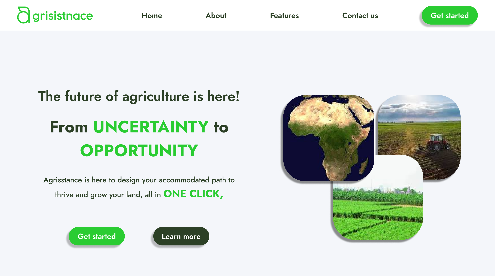
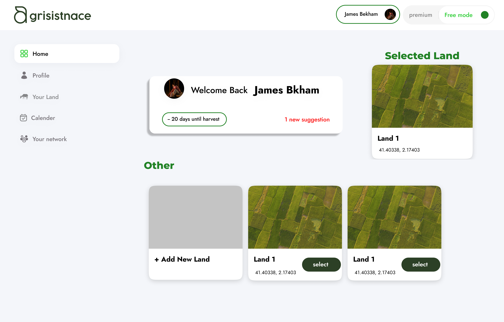

<!--  -->
<div align="center">
  
</div>

# 🌱 AGRISISTANCE

**A2SV-Agrisistance** is an AI-driven web application aimed at helping African farmers optimize land use and boost crop productivity. Utilizing advanced machine learning algorithms and data analytics, AGRISISTANCE offers actionable insights and personalized recommendations tailored to individual farming needs.



## Table of Contents

- [🌱 AGRISISTANCE](#-agrisistance)
  - [Table of Contents](#table-of-contents)
  - [Python Build Status](#python-build-status)
  - [Dependencies](#dependencies)
  - [GitHub Issues](#github-issues)
    - [Reporting Issues](#reporting-issues)
    - [Contributing](#contributing)
  - [Features](#features)
    - [Optimizing Land Use](#optimizing-land-use)
    - [Boosting Crop Productivity](#boosting-crop-productivity)
    - [Business Planning](#business-planning)
    - [Resource Management](#resource-management)
    - [Networking and Industrial Connections](#networking-and-industrial-connections)
  - [Getting Started](#getting-started)
    - [Prerequisites](#prerequisites)
    - [Cloning the Repository](#cloning-the-repository)
    - [Installing Dependencies](#installing-dependencies)
    - [Running the Application](#running-the-application)
    - [Building for Production](#building-for-production)
    - [Running Tests](#running-tests)
    - [Additional Configuration](#additional-configuration)
    - [Troubleshooting](#troubleshooting)
    - [Documentation](#documentation)
  - [Our Perspective](#our-perspective)
  - [Comparison with Competitors](#comparison-with-competitors)
  - [Contact](#contact)
  - [License](#license)

## Python Build Status


## Dependencies

- React (typescript)
- Node.js
- Express.js
- scikit-learn
- Other dependencies

## GitHub Issues

If you encounter any problems or have suggestions for improving this project, please use the GitHub Issues feature to report them. Here’s how you can contribute effectively:

### Reporting Issues

1. **Check Existing Issues**: Before creating a new issue, please check the [existing issues](https://github.com/AGRISISTANCE/Agrisistance-Front/issues) to see if your problem or feature request has already been reported. You can use the search bar to look for similar issues.

2. **Create a New Issue**: If your issue or request is not listed, please [open a new issue](https://github.com/AGRISISTANCE/Agrisistance-Front/issues/new/choose) and provide the following details:
   - **Title**: A concise and descriptive title.
   - **Description**: A detailed description of the issue or feature request.
   - **Steps to Reproduce** (for bugs): Step-by-step instructions to reproduce the issue.
   - **Expected Behavior**: What you expected to happen.
   - **Actual Behavior**: What actually happened.
   - **Screenshots/Logs**: Attach any relevant screenshots or logs.
   - **Environment Details**: Information about your environment (e.g., OS, browser, version).

3. **Labeling Issues**: When creating an issue, labels will be added to categorize it (e.g., `bug`, `feature`, `enhancement`). This helps in tracking and prioritizing the issues.

### Contributing

If you want to contribute to the project by fixing issues or adding new features:

1. **Fork the Repository**: Create a fork of the repository on GitHub.
2. **Clone Your Fork**: Clone your fork to your local machine.
3. **Create a Branch**: Create a new branch for your changes.
4. **Make Changes**: Implement your changes or fixes.
5. **Submit a Pull Request**: Push your changes to your fork and submit a pull request to the main repository. Reference the issue you are addressing in your pull request description.

## Features

### Optimizing Land Use

- 🌿 Analyzes soil properties, weather conditions, and historical crop data.
- 🌾 Provides recommendations for optimal crop selection and planting schedules.

### Boosting Crop Productivity

- 💧 Personalized advice on irrigation, fertilization, and pest management.
- 📈 AI-driven insights to enhance crop yields.

### Business Planning

- 💼 Financial forecasts, market trends, and cost-benefit analyses.
- 🗺️ Strategic planning and decision-making support.

### Resource Management

- 💧 Monitors water usage and tracks seed and fertilizer inventory.
- 📊 Tools for efficient resource management.

### Networking and Industrial Connections

- 🌍 Connects farmers with related industries, such as delivery services and processing factories.
- 🔗 Streamlines supply chain processes and builds valuable industrial connections.

## Getting Started

Follow these steps to set up and run the AGRISISTANCE project locally:

### Prerequisites

Before you begin, ensure you have the following installed:

- [Node.js](https://nodejs.org/): This project requires Node.js to run. Download and install it from [nodejs.org](https://nodejs.org/).
- [Git](https://git-scm.com/): You’ll need Git to clone the repository. Download and install it from [git-scm.com](https://git-scm.com/).

### Cloning the Repository

1. **Clone the repository**: Open your terminal or command prompt and run the following command:

    ```bash
    git clone https://github.com/AGRISISTANCE/Agrisistance-Front.git
    ```

2. **Navigate to the project directory**:

    ```bash
    cd Agrisistance-Front
    ```

### Installing Dependencies

1. **Install project dependencies**: Run the following command to install all the required npm packages:

    ```bash
    npm install
    ```

### Running the Application

1. **Start the development server**: After the dependencies are installed, start the server with:

    ```bash
    npm start
    ```

2. **Access the application**: Open your web browser and navigate to `http://localhost:3000` (default port is 3000).

### Building for Production

If you want to build the application for production:

1. **Build the project**: Run the following command to create an optimized build:

    ```bash
    npm run build
    ```

2. **Deploy the build**: The build files will be located in the `build/` directory. You can deploy these files to your preferred hosting service.

### Running Tests

To ensure everything is working correctly, you can run the tests:

### Additional Configuration

- **Environment Variables**: Some configurations might require environment variables. Create a `.env` file in the root of the project and add your variables there. Refer to `.env.example` for the required variables and their format.

### Troubleshooting

- **Common Issues**: If you encounter any issues during setup, ensure that all dependencies are installed correctly and check the console for error messages. You can also refer to the [GitHub Issues](#github-issues) page for known issues and solutions.

### Documentation

- **Project Documentation**: For detailed documentation, refer to the [Documentation](#-agrisistance) directory in the repository.

By following these steps, you should have AGRISISTANCE up and running on your local machine. If you need further assistance, please refer to the [Contact](#contact) section for support.

## Our Perspective

- 🌐 **Virtual Farm System Integration:** Simulate different scenarios for informed decision-making.
- 📱 **Mobile Application Development:** Enhance accessibility and usability through mobile platforms.

## Comparison with Competitors

| Feature                               | AGRISISTANCE | Intellias | OneSoil |
| ------------------------------------- | ------------ | --------- | ------- |
| AI-driven insights                    | ✅            | ✅         | ✅       |
| Personalized recommendations          | ✅            | ✅         | ✅       |
| Networking and industrial connections | ✅            | ❌         | ❌       |
| Resource management tools             | ✅            | ❌         | ❌       |
| Virtual farm system (future)          | ✅            | ❌         | ❌       |

## Contact

For inquiries or feedback, reach out to us at:

- 📧 Email: [amel.feddag@ensia.edu.dz](mailto:amel.feddag@ensia.edu.dz)
- 🌐 WhatsApp: +213 555 05 04 96

## License

This project is licensed under the Apache 2.0 License. See the [LICENSE](License.txt) file for details.

---

This repository includes front-end code, as well as the AI models used in AGRISISTANCE.



.png)
